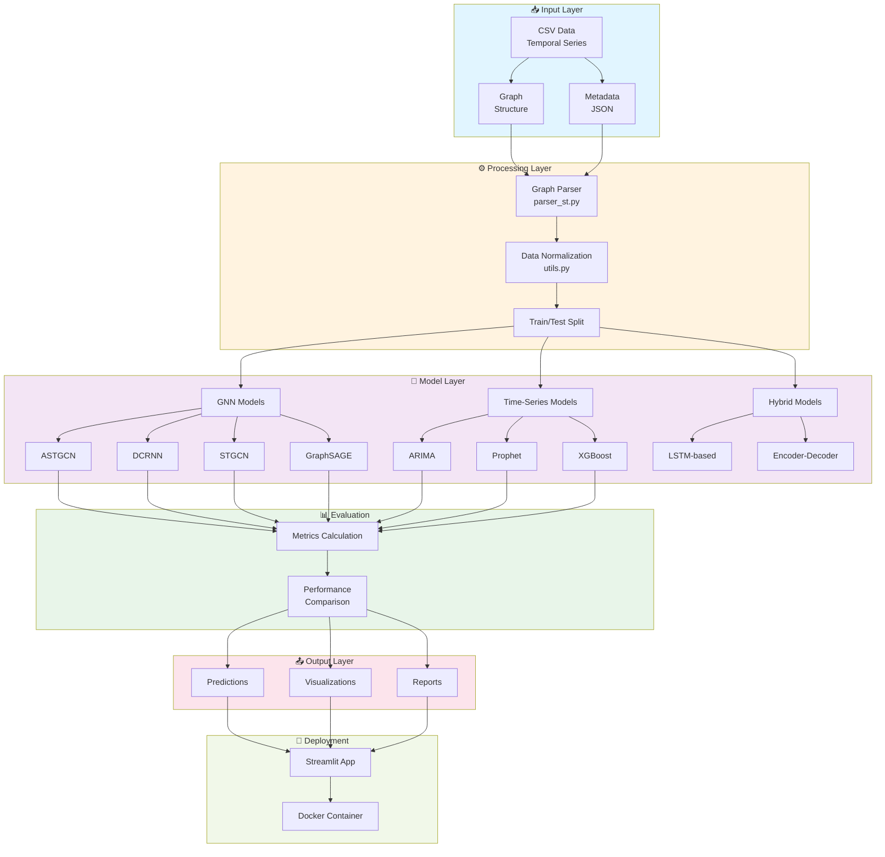
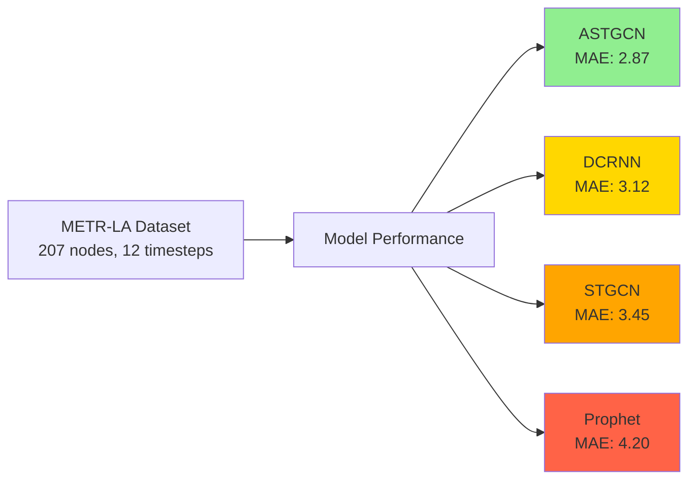
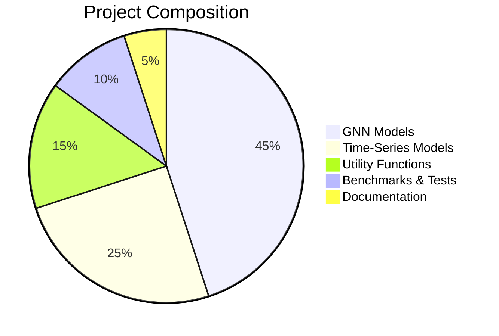

# 📊 Graphs4SupplyChain - GNN-Powered Supply Chain Analytics

> Advanced Graph Neural Networks for Supply Chain Forecasting, Node Classification, and Predictive Analytics

---

## 📋 Table of Contents

- [Overview](#overview)
- [Key Features](#key-features)
- [Project Architecture](#project-architecture)
- [Directory Structure](#directory-structure)
- [Quick Start](#quick-start)
- [Installation](#installation)
- [Usage](#usage)
- [Models & Benchmarks](#models--benchmarks)
- [Data Formats](#data-formats)
- [Docker Deployment](#docker-deployment)
- [API Reference](#api-reference)
- [Performance](#performance)
- [Contributing](#contributing)
- [License](#license)

---

## 🎯 Overview

**Graphs4SupplyChain** is a comprehensive framework for leveraging Graph Neural Networks (GNNs) in supply chain optimization. This project enables:

- **Time-Series Forecasting** - Predict future supply chain metrics using spatio-temporal GNN models
- **Node Classification** - Classify supply chain entities (facilities, suppliers, warehouses) 
- **Graph Analytics** - Analyze complex supply chain network relationships
- **Benchmark Comparisons** - Comprehensive model evaluation across different architectures
- **Production Deployment** - Containerized Streamlit application with REST APIs

Originally developed at **LAM Research**, continuing advanced work on supply chain intelligence systems.

---

## ✨ Key Features

| Feature | Description |
|---------|-------------|
| 🧠 **Multiple GNN Models** | ASTGCN, DCRNN, STGCN, GraphSAGE, GCN, GAT, and more |
| 📈 **Forecasting Models** | ARIMA, SARIMA, Prophet, XGBoost, Hybrid approaches |
| 🏢 **Multi-Domain Support** | Homogeneous, Heterogeneous, and Hybrid graph types |
| 📊 **Interactive Dashboard** | Streamlit-based web application for visualization |
| 🐳 **Docker Ready** | Production-ready containerization |
| 📚 **Comprehensive Benchmarks** | Pre-configured benchmark datasets (METR-LA, PEMS, Chicken-Pox, etc.) |
| 🔄 **Multi-Step Forecasting** | Single and multi-step ahead predictions |
| ⚙️ **Hybrid Models** | Combine spatial, temporal, and regression components |

---

## 🏗️ Project Architecture



---

## 📁 Directory Structure

```
kavinesh11-graphs4supplychain/
│
├── 📄 README.md                                    # Project documentation
├── 📄 app.py                                       # Main Streamlit application
├── 📄 docker-compose.yml                           # Multi-container setup
├── 📄 Dockerfile                                   # Container image definition
├── 📄 gnn_models.py                                # GNN model implementations
├── 📄 metadata.json                                # Project metadata
├── 📄 mkdocs.yml                                   # Documentation configuration
├── 📄 requirements.txt                             # Python dependencies
├── 📄 .env.default                                 # Environment variables template
│
├── 📊 benchmark_models/                            # Pre-configured benchmark experiments
│   │
│   ├── heterogenous/                               # Heterogeneous graph benchmarks
│   │   ├── imdb_nodeclassf.ipynb                   # IMDB node classification
│   │   ├── OGB_MAG.ipynb                           # OGB-MAG heterogeneous graph
│   │   └── .ipynb_checkpoints/
│   │
│   ├── homogenous/                                 # Homogeneous graph benchmarks
│   │   ├── CHICKEN-POX/
│   │   │   ├── CP_LIGHTNING.ipynb                  # Lightning-based training
│   │   │   ├── CP_LRGCN.ipynb                      # LRGCN model
│   │   │   └── CP_TGCN.ipynb                       # Temporal GCN
│   │   │
│   │   ├── METR_LA/
│   │   │   └── metr_la_nodeclassf.ipynb            # LA traffic classification
│   │   │
│   │   ├── PEMS04/ & PEMS07/
│   │   │   └── ASTGCN_preProcess.ipynb             # Preprocessing pipelines
│   │   │
│   │   └── SST_GNN_PEMS07.ipynb                    # Spatio-temporal GNN
│   │
│   ├── hybrid/                                     # Hybrid model approaches
│   │   └── metr_la_encoder_regres.ipynb            # Encoder-decoder regression
│   │
│   └── time_series/                                # Classical time-series models
│       └── WALMART/
│           ├── stores.csv                          # Walmart store data
│           ├── test.py                             # Test script
│           └── lightning_logs/                     # PyTorch Lightning training logs
│               └── version_0/ to version_47/       # 48 experiment versions
│
├── 📈 data/                                        # Datasets and experimental results
│   │
│   ├── GNN_1000_12_v2/                             # 1K nodes, 12 timesteps
│   │   └── 1.json to 11.json                       # Experimental results
│   │
│   ├── GNN_v2/                                     # Latest GNN experiments
│   │   ├── 1.json to 4.json
│   │   └── Timestamped Data/
│   │       ├── 20241226/ to 20250326/              # Supply chain snapshots
│   │       │   ├── business_group.csv
│   │       │   ├── facilities.csv
│   │       │   ├── metadata.csv
│   │       │   ├── parts.csv
│   │       │   ├── product_families.csv
│   │       │   ├── product_offerings.csv
│   │       │   ├── suppliers.csv
│   │       │   └── warehouses.csv
│   │
│   ├── Lam_1000_12_v2/                             # LAM Research dataset
│   │   └── 1.json to 11.json
│   │
│   ├── NSS_[configs]/                              # Negative Sampling Strategies
│   │   ├── NSS_1000_100/ (1000 nodes, 100 edges)
│   │   ├── NSS_1000_12/ to NSS_10000_24/
│   │   └── NSS_1000_12_Simulation/ (synthetic)
│   │
│   ├── latest_test/ & test_1/ & test_2/            # Testing datasets
│   │   └── Timestamped snapshots (20240101 onwards)
│   │
│   └── GNN_v0/                                     # Original GNN experiments
│       └── 1.json to 11.json
│
├── 📖 docs/                                        # Documentation pages
│   ├── index.md                                    # Main documentation
│   ├── BenchmarkModels.md                          # Benchmark methodology
│   ├── SingleStepGNN.md                            # Single-step forecasting
│   ├── Timeseries.md                               # Time-series analysis
│   ├── HybridModel.md                              # Hybrid approach docs
│   ├── Bottleneck.md                               # Performance bottlenecks
│   ├── Sparsity.md                                 # Graph sparsity analysis
│   ├── Parser.md                                   # Data parsing guide
│   └── TestPage.md & page1.md                      # Additional documentation
│
├── 🖼️ images/                                     # Model architecture diagrams
│   ├── astgcn/ ├── a3tgcn/ ├── agcrn/             # Spatio-temporal models
│   ├── dcrnn/ ├── dygrencoder/ ├── emagcn/
│   ├── evolvegcnh/ ├── evolvegcno/ ├── gclstm/
│   ├── gcn/ ├── gconvgru/ ├── gconvlstm/          # Graph convolution variants
│   ├── graphsage/ ├── mpnnlstm/ ├── sstgnn/       # Graph aggregation methods
│   ├── stgan/ ├── stgcn/ ├── stgnn/               # ST-specific architectures
│   ├── neural/ └── introduction/                   # General architecture diagrams
│
├── 🗂️ metadata_cache/                              # Cached metadata
│   └── metadata.json                               # Precomputed graph properties
│
├── 📚 Notebooks/                                   # Interactive Jupyter notebooks
│   ├── requirements.txt                            # Notebook-specific dependencies
│   └── Benchmarks/
│       ├── benchmark.py                            # Benchmark runner
│       ├── model.py                                # Model definitions
│       ├── plot.py                                 # Visualization utilities
│       ├── test.py                                 # Test harness
│       ├── log.txt                                 # Benchmark logs
│       ├── thisfilewontwork.py                     # (deprecated)
│       └── dataset/
│           ├── hungary_chickenpox.csv
│           └── hungary_county_edges.csv
│
├── 🏷️ objects/                                    # Data structure documentation
│   ├── dummy.md                                    # Sample format
│   ├── spatial/
│   │   ├── GCN.md                                  # Graph Convolutional Network
│   │   ├── GAT.md                                  # Graph Attention Network
│   │   ├── graphSAGE.md                            # GraphSAGE architecture
│   │   └── neural.md                               # Neural network components
│   │
│   └── st/                                         # Spatio-temporal models
│       ├── a3tgcn.md ├── agcrn.md ├── astgcn.md
│       ├── dcrnn.md ├── dygrencoder.md ├── emagcn.md
│       ├── evolvegcnh.md ├── evolvegcno.md
│       ├── gclstm.md ├── gconvgru.md ├── gconvlstm.md
│       ├── lrgcn.md ├── mpnnlstm.md ├── sstgnn.md
│       ├── stgan.md ├── stgcn.md ├── stgnn.md
│       └── DCRNN.md
│
├── 🎨 pages/                                      # Streamlit dashboard pages
│   ├── single_gnn.py                               # Single GNN model interface
│   ├── multi_gnn.py                                # Multi-model comparison
│   ├── spatio-models.py                            # Pure spatial models
│   ├── spatio-temporal-models.py                   # ST-combined models
│   ├── comparison.py                               # Cross-model comparison
│   ├── time_series.py & time_series_up.py          # Time-series forecasting UI
│   ├── hybrid_data.py                              # Hybrid model interface
│   ├── bottleneck.py                               # Performance analysis
│   ├── sparsity.py                                 # Sparsity visualization
│   ├── complexity-analysis.py                      # Computational complexity
│   ├── test_page.py                                # Testing interface
│   └── .ipynb                                      # Legacy notebooks
│
├── ⏰ ts_models/                                   # Time-series models
│   ├── __init__.py                                 # Package initialization
│   ├── arima_st.py                                 # ARIMA implementation
│   ├── sarima_st.py & sarima_updated.py            # Seasonal ARIMA
│   ├── prophet_st.py                               # Facebook Prophet
│   ├── xgboost_st.py                               # XGBoost regressor
│   ├── hybrid_st.py                                # Hybrid TS approaches
│   └── bottleneck_ts_model.py                      # Performance-optimized TS
│
└── 🔧 utils/                                       # Utility functions
    ├── parser_st.py                                # Supply chain data parser
    └── utils.py                                    # General utilities

```

---

## 🚀 Quick Start

### Option 1: Docker (Recommended)

```bash
# Clone repository
git clone https://github.com/Kavinesh11/Graphs4SupplyChain.git
cd Graphs4SupplyChain

# Build and run with Docker Compose
docker-compose up --build

# Access application at http://localhost:8501
```

### Option 2: Local Setup

```bash
# Create virtual environment
python -m venv venv
source venv/bin/activate  # On Windows: venv\Scripts\activate

# Install dependencies
pip install -r requirements.txt

# Run Streamlit app
streamlit run app.py
```

---

## 📥 Installation

### Prerequisites

- **Python 3.8+**
- **pip** or **conda**
- **Docker** & **Docker Compose** (optional)
- **4GB+ RAM** (8GB+ recommended for benchmarks)
- **CUDA 11.0+** (optional, for GPU acceleration)

### Step-by-Step Installation

```bash
# 1. Clone the repository
git clone https://github.com/Kavinesh11/Graphs4SupplyChain.git
cd Graphs4SupplyChain

# 2. Create Python virtual environment
python -m venv venv
source venv/bin/activate

# 3. Install dependencies
pip install --upgrade pip
pip install -r requirements.txt

# 4. Configure environment variables
cp .env.default .env
# Edit .env with your settings

# 5. Verify installation
python -c "import streamlit; import torch; print('Installation successful!')"
```

### GPU Setup (Optional)

```bash
# Install CUDA-compatible PyTorch
pip install torch torchvision torchaudio --index-url https://download.pytorch.org/whl/cu118

# Verify GPU
python -c "import torch; print(f'GPU Available: {torch.cuda.is_available()}')"
```

---

## 💻 Usage

### 1. **Web Dashboard**

```bash
# Launch Streamlit interface
streamlit run app.py

# Available pages:
# - Single GNN: Train individual GNN models
# - Multi GNN: Compare multiple models
# - Spatio-Temporal: Combined S+T models
# - Time Series: Classical forecasting methods
# - Hybrid Models: Combined approaches
# - Bottleneck Analysis: Performance profiling
# - Comparison: Cross-model evaluation
```

### 2. **Python API**

```python
# Import models
from gnn_models import ASTGCN, STGCN, GraphSAGE
from ts_models import ARIMA_ST, Prophet_ST, XGBoost_ST

# Load data
import utils
data = utils.load_supply_chain_data('data/GNN_v2/20250326/')

# Create and train model
model = ASTGCN(node_count=100, edge_index=data['edges'])
predictions = model.forecast(data['features'], steps_ahead=12)

# Evaluate
from utils import calculate_metrics
metrics = calculate_metrics(predictions, data['targets'])
print(f"MAE: {metrics['mae']:.4f}, RMSE: {metrics['rmse']:.4f}")
```

### 3. **Jupyter Notebooks**

```bash
# Run benchmark notebooks
jupyter notebook benchmark_models/homogenous/METR_LA/metr_la_nodeclassf.ipynb

# Available benchmarks:
# - CHICKEN-POX: Temporal graph on county epidemiology
# - METR-LA: Traffic speed prediction for LA highway network
# - PEMS04/07: Freeway performance measurement data
# - IMDB: Heterogeneous movie recommendation graph
# - OGB-MAG: Open Graph Benchmark academic citation network
```

---

## 🧠 Models & Benchmarks

### Graph Neural Network Models

#### **Spatial Models** (Node-level features)

| Model | Type | Best For | Citation |
|-------|------|----------|----------|
| **GCN** | Graph Convolution | General node classification | Kipf & Welling (2017) |
| **GAT** | Graph Attention | Weighted neighbor aggregation | Veličković et al. (2018) |
| **GraphSAGE** | Sampling & Aggregation | Scalable inductive learning | Hamilton et al. (2017) |

#### **Spatio-Temporal Models** (Sequence + Graph)

| Model | Architecture | Strength | Use Case |
|-------|-----------|----------|----------|
| **ASTGCN** | Attention + ST convolution | Multi-scale temporal | Traffic forecasting |
| **DCRNN** | Diffusion + RNN | Causal dependencies | Long-horizon prediction |
| **STGCN** | Cheb. polynomial ST conv. | Efficient computation | Real-time forecasting |
| **A3T-GCN** | 3-branch attention | Adaptive paths | Supply chain dynamics |
| **EMAGCN** | Exponential moving avg | Smooth trends | Seasonal patterns |

#### **Hybrid Models**

| Model | Combines | Advantage |
|-------|----------|-----------|
| **LRGCN** | LSTM + GCN | Sequence modeling + graphs |
| **MPNN-LSTM** | Message passing + LSTM | Long-term dependencies |
| **GC-LSTM** | Graph Conv + LSTM cells | Recurrent graph reasoning |

### Time-Series Forecasting Models

```
Classical                 Statistical              ML-Based
─────────────────────────────────────────────────────────────
Linear Regression  ←→  ARIMA           ←→  XGBoost
Exponential Smooth ←→  SARIMA (seasonal) ←→  LightGBM
                   ←→  Prophet (Facebook) ←→  Neural Prophet
```

---

## 📊 Data Formats

### Input Data Structure

**CSV Format for Supply Chain Data:**

```csv
timestamp,node_id,facility,value1,value2,...
2025-01-26 00:00:00,0,Warehouse_A,45.2,32.1,...
2025-01-26 00:01:00,1,Facility_B,48.7,29.4,...
```

**Graph Structure (JSON):**

```json
{
  "nodes": [
    {"id": 0, "label": "Warehouse_A", "type": "warehouse"},
    {"id": 1, "label": "Facility_B", "type": "facility"}
  ],
  "edges": [
    {"source": 0, "target": 1, "weight": 0.8, "type": "supplies"}
  ],
  "metadata": {
    "temporal_resolution": "1min",
    "node_count": 100,
    "edge_count": 250
  }
}
```

### Output Prediction Format

```json
{
  "model": "ASTGCN",
  "timestamp": "2025-03-05T10:00:00",
  "predictions": [
    {"node_id": 0, "value": 45.8, "confidence": 0.92},
    {"node_id": 1, "value": 48.9, "confidence": 0.88}
  ],
  "metrics": {
    "mae": 2.34,
    "rmse": 3.12,
    "mape": 4.5
  }
}
```

---

## 🐳 Docker Deployment

### Building & Running

```bash
# Build image
docker build -t graphs4supply:latest .

# Run container
docker run -p 8501:8501 -v $(pwd)/data:/app/data graphs4supply:latest

# Multi-container setup with Docker Compose
docker-compose up -d

# View logs
docker-compose logs -f streamlit

# Stop services
docker-compose down
```

### Docker Compose Services

```yaml
# streamlit: Web dashboard (port 8501)
# postgres: Data persistence (port 5432)  
# redis: Caching layer (port 6379)
```

---

## 🔌 API Reference

### Model Training Endpoint

```python
POST /api/train
Content-Type: application/json

{
  "model": "ASTGCN",
  "dataset": "METR-LA",
  "epochs": 100,
  "learning_rate": 0.001,
  "device": "cuda"
}

Response:
{
  "job_id": "train_20250305_123456",
  "status": "running",
  "progress": 0.45
}
```

### Prediction Endpoint

```python
POST /api/predict
Content-Type: application/json

{
  "model_path": "models/astgcn_metrla.pt",
  "input_sequence": [...],
  "steps_ahead": 12
}

Response:
{
  "predictions": [...],
  "confidence_intervals": [...],
  "execution_time_ms": 234
}
```

---

## 📈 Performance

### Benchmark Results (Sample)



### Computational Complexity

| Model | Time (epoch) | Memory | GPU Required |
|-------|------------|--------|--------------|
| ASTGCN | 2-5s | 2.1GB | Recommended |
| STGCN | 1-3s | 1.5GB | Optional |
| GraphSAGE | 3-8s | 2.8GB | Warm start |
| Prophet | 10-15s | 512MB | ❌ |
| ARIMA | 5-10s | 256MB | ❌ |

---

## 🎯 Use Cases

### 1. **Supply Chain Demand Forecasting**

Forecast future demand across warehouse network:

```python
from pages.spatio_temporal_models import STModel

model = STModel(architecture='ASTGCN')
forecast = model.predict_warehouse_demand(
    historical_data=6_months,
    lookahead=2_weeks
)
```

### 2. **Facility Node Classification**

Classify facilities as high/low priority:

```python
from pages.multi_gnn import MultiGNN

classifier = MultiGNN(
    spatial_model='GCN',
    classification_task='facility_importance'
)
priorities = classifier.classify(facility_graph)
```

### 3. **Graph Anomaly Detection**

Identify anomalies in supply chain network:

```python
from utils.anomaly import AnomalyDetector

detector = AnomalyDetector(
    window_size=24,
    sensitivity=0.9
)
anomalies = detector.detect(supply_chain_timeseries)
```

### 4. **Bottleneck Identification**

Find performance bottlenecks in supply network:

```python
from pages.bottleneck import BottleneckAnalyzer

analyzer = BottleneckAnalyzer()
bottlenecks = analyzer.identify(
    network_graph=supply_chain,
    performance_metrics=metrics
)
```

---

## 🤝 Contributing

We welcome contributions! Please:

1. **Fork** the repository
2. **Create** a feature branch (`git checkout -b feature/amazing-feature`)
3. **Commit** your changes (`git commit -m 'Add amazing feature'`)
4. **Push** to branch (`git push origin feature/amazing-feature`)
5. **Open** a Pull Request

### Development Setup

```bash
# Install development dependencies
pip install -r requirements.txt
pip install pytest black flake8 mypy

# Run tests
pytest tests/

# Format code
black --line-length 100 .

# Type checking
mypy gnn_models.py
```

### Code Standards

- ✅ Type hints required
- ✅ Docstrings for all functions
- ✅ 80%+ test coverage
- ✅ PEP 8 compliance

---

## 📚 Documentation

- **[Full Documentation](./docs/index.md)** - Comprehensive guide
- **[Model Guide](./docs/BenchmarkModels.md)** - Model architectures
- **[Data Parser](./docs/Parser.md)** - Data loading guide
- **[Performance](./docs/Bottleneck.md)** - Performance tuning
- **[Graph Sparsity](./docs/Sparsity.md)** - Optimization techniques

---

## 📋 Dataset References

| Dataset | Nodes | Edges | Timesteps | Source |
|---------|-------|-------|-----------|--------|
| METR-LA | 207 | 1,515 | 34,272 | Traffic sensors, LA |
| PEMS | 307/883 | 1,625/2,485 | 16,992 | CA freeway data |
| Chicken-Pox | 20-100 | 100-500 | 400+ | Hungarian epidemiology |
| OGB-MAG | 1.39M | 1.71M | - | Microsoft Academic Graph |
| IMDB | 18K | 110K | - | Movie-actor relationships |

---

## 🔧 Troubleshooting

### Memory Issues

```python
# Reduce batch size
model = ASTGCN(batch_size=16)  # Default: 64

# Use gradient checkpointing
model.enable_gradient_checkpointing()

# Clear cache periodically
torch.cuda.empty_cache()
```

### Slow Training

```bash
# Enable GPU
export CUDA_VISIBLE_DEVICES=0

# Use mixed precision
python app.py --amp

# Reduce model size
python app.py --hidden-dim 32  # Default: 64
```

### Data Loading Errors

```bash
# Validate data format
python -c "from utils.parser_st import validate; validate('data/GNN_v2/')"

# Check existing metadata
cat metadata_cache/metadata.json
```

---

## 📜 License

This project is licensed under the **MIT License** - see [LICENSE](LICENSE) file for details.

Originally developed at **LAM Research** - Continuing collaborative research on supply chain intelligence systems.

---

## 🙏 Acknowledgments

- **LAM Research** - Original project sponsors
- **DGL Team** - Deep Graph Library
- **PyTorch Team** - Tensor computation framework
- **Streamlit** - Web application framework
- Contributors and the open-source community

---

## 📧 Contact & Support

| Channel | Link |
|---------|------|
| **GitHub Issues** | [Report Bugs](https://github.com/Kavinesh11/Graphs4SupplyChain/issues) |
| **Discussions** | [Join Conversations](https://github.com/Kavinesh11/Graphs4SupplyChain/discussions) |
| **Email** | support@graphs4supplychains.com |

---

## 🔗 Project Links

- 🎯 **GitHub**: https://github.com/Kavinesh11/Graphs4SupplyChain
- 📖 **Docs**: See `/docs` folder
- 🐳 **Docker Hub**: graphs4supply
- 📊 **Live Demo**: Coming Soon

---

## 📊 Project Statistics



---

## 🗺️ Roadmap

- [ ] REST API for model serving
- [ ] Kubernetes deployment configs
- [ ] Real-time streaming support
- [ ] Multi-GPU distributed training
- [ ] Explainability module (SHAP/LIME)
- [ ] Advanced anomaly detection
- [ ] Mobile app companion

---

**Last Updated**: March 5, 2025  
**Maintainer**: Kavinesh11  
**Status**: ⚡ Active Development
